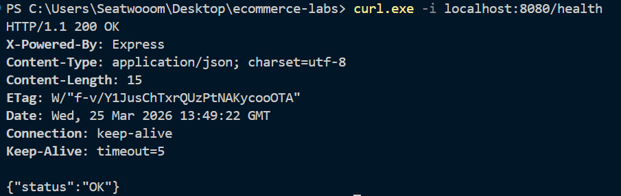
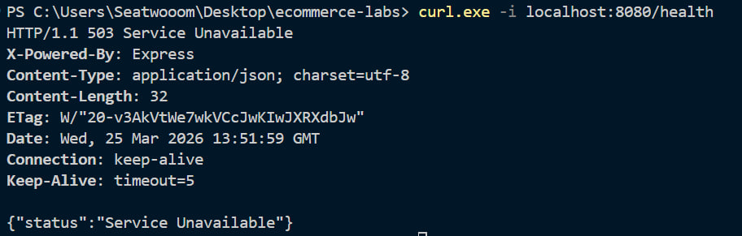

# E-commerce App - Лабораторна робота №0

## Мета

Стандартизація застосунку до рівня "Commerce-Ready": впровадження 12-Factor App конфігурації, Health Checks, JSON логування та Graceful Shutdown.

---

## 🛠 Налаштування (Environment Variables)

Застосунок зчитує всі параметри зі змінних оточення. Для локального запуску використовується файл `.env`:

| Змінна        | Значення (приклад) | Опис                     |
| :------------ | :----------------- | :----------------------- |
| `DB_HOST`     | `127.0.0.1`        | Адреса бази даних        |
| `DB_PORT`     | `5433`             | Порт бази даних (Docker) |
| `DB_NAME`     | `ecommerce`        | Назва БД                 |
| `DB_USER`     | `user`             | Користувач БД            |
| `DB_PASSWORD` | `pass`             | Пароль користувача       |
| `PORT`        | `8080`             | Порт застосунку          |

---

## ✅ Підтвердження Health Check (200 OK)

Результат запиту, коли база даних підключена та працює:
`curl.exe -i localhost:8080/health`



---

## ❌ Підтвердження Health Check (503 Service Unavailable)

Результат запиту після зупинки бази даних (`docker stop lab0-db`):
`curl.exe -i localhost:8080/health`



---

## 📝 Приклад логів (JSON)

Кілька рядків структурованих логів під час запуску та обробки запитів:

```json
{"level":30,"time":1774446906061,"pid":51904,"hostname":"Seatwoom","message":"Running migrations..."}
{"level":30,"time":1774446906111,"pid":51904,"hostname":"Seatwoom","message":"Server started on port 8080"}
{"level":30,"time":1774446909825,"pid":51904,"hostname":"Seatwoom","timestamp":"2026-03-25T13:55:09.825Z","level":"INFO","message":"SIGINT received. Starting graceful shutdown..."}
{"level":30,"time":1774446909826,"pid":51904,"hostname":"Seatwoom","message":"HTTP server closed."}
{"level":30,"time":1774446909832,"pid":51904,"hostname":"Seatwoom","message":"Database connections closed. Process exited."}
```
